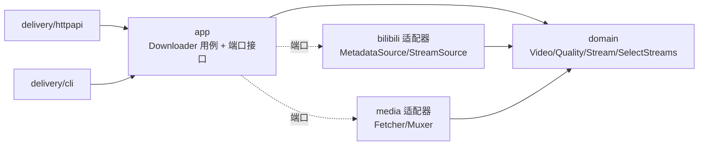

# bili2go

用 Go 实现的哔哩哔哩（Bilibili）DASH 视频下载器：解析视频真实播放地址，并发拉取分离的音/视频流，用 ffmpeg 合并为可播放的 MP4。提供 **CLI** 与 **HTTP API** 两种用法。

> 本项目仅供学习与研究，请遵守当地法律法规与 B 站用户协议，勿用于商业或大规模传播。

## 特性

- 解析 `bvid`/视频 URL → 元数据、分 P、DASH 播放清单
- 清晰度自动选择与**降级**（请求超出可用时回退到实际最高）
- 编码优选与回退：AVC(H.264) / HEVC(H.265) / AV1
- 音视频分离流并发下载 + 备用源（backupUrl）容灾
- ffmpeg `-c copy` 无损合并（不转码，秒级）
- CLI + HTTP API 双入口
- 零第三方依赖（仅 Go 标准库）

## 环境要求

- Go 1.24+
- [ffmpeg](https://ffmpeg.org/)（用于合并；`ffmpeg`、`ffprobe` 需在 PATH 中）
  - macOS: `brew install ffmpeg`

## 安装 / 构建

```bash
git clone {your-fork-url} bili2go && cd bili2go

# 方式一：构建出二进制到当前目录，然后用 ./bili2go 运行
go build -o bili2go ./cmd/bili2go
./bili2go info -bvid {BVID}

# 方式二：安装到 $GOBIN（在 PATH 中即可直接用 bili2go）
go install ./cmd/bili2go
bili2go info -bvid {BVID}
```

> `cmd/bili2go/` 是 Go 惯例的 main 包**源码**目录，不能直接执行；执行的是 `go build`/`go install` 产出的二进制。

## 使用

下面示例以 `go run` 直接运行源码（免构建）；若已构建/安装，把 `go run ./cmd/bili2go` 换成 `./bili2go` 或 `bili2go` 即可。

### CLI

```bash
# 查询可用清晰度与信息（把 {BVID} 换成真实 BV 号或视频页 URL）
go run ./cmd/bili2go info -bvid {BVID}

# 下载并合并为 mp4
go run ./cmd/bili2go dl -bvid {BVID} -qn 80 -codec avc -o out.mp4

# 多 P：用 -page 指定分 P
go run ./cmd/bili2go dl -bvid {BVID} -page 2 -o p2.mp4

# 启动 HTTP 服务
go run ./cmd/bili2go serve -addr :8080
```

`-bvid` 接受裸 `BV` 号或完整视频页 URL。占位符 `{BVID}` 仅为示例，请替换为真实值。

#### 子命令与参数

- `info`：查询可用清晰度与信息（不下载），支持 `-bvid -page -qn -codec -sessdata`
- `dl`：下载并合并 mp4，支持 `info` 的全部参数，外加**必填** `-o`
- `serve`：启动 HTTP 服务，支持 `-addr -sessdata`

| 参数 | 适用 | 默认 | 含义 |
|---|---|---|---|
| `-bvid` | info, dl | 必填 | 视频 BV 号或视频页 URL |
| `-page` | info, dl | `1` | 分 P 序号（1 起） |
| `-qn` | info, dl | 可用最高 | **目标清晰度码**（见下方码表）；请求超出可用时自动降级到实际最高。`info` 下用于预览会选中的清晰度 |
| `-codec` | info, dl | `avc` | **期望视频编码**：`avc`(H.264) / `hevc`(H.265) / `av1`；该清晰度无此编码时按回退选择 |
| `-o` | **dl** | 必填 | **输出 mp4 文件路径**（仅 `dl`；`info` 不产出文件，传 `-o` 会报错） |
| `-addr` | serve | `:8080` | HTTP 监听地址（`host:port`） |
| `-sessdata` | 全部 | 环境变量 `BILI_SESSDATA` | 登录 Cookie SESSDATA，决定可下载的清晰度上限 |

### HTTP API

```bash
# 可用清晰度（把 {BVID} 换成真实 BV 号）
curl 'http://127.0.0.1:8080/api/info?bvid={BVID}'
# → {"bvid":"...","aid":...,"cid":...,"page":1,"title":"...","duration":213,
#    "current":{"qn":32,"name":"480P","codec":"AVC"},
#    "qualities":[{"qn":32,"name":"480P"},{"qn":16,"name":"360P"}]}
#   （示例为匿名，通常仅 ≤480P；配置 SESSDATA 后可出现 720P/1080P）

# 下载（浏览器直接访问即触发下载）；qn/codec 可选
curl -OJ 'http://127.0.0.1:8080/download?bvid={BVID}&qn=80&codec=avc'
```

| 端点 | 参数 | 说明 |
|---|---|---|
| `GET /api/info` | `bvid`(必), `page`, `qn` | 返回清晰度与信息 JSON |
| `GET /download` | `bvid`(必), `qn`, `page`, `codec` | 回传合并后的 mp4（响应头含 `X-Bili-Quality`/`X-Bili-Codec`） |

错误返回非 2xx + `{"code":<int>,"message":"<str>"}`。

### 清晰度与登录态（SESSDATA）

清晰度码（qn）：`16=360P 32=480P 64=720P 80=1080P 112=1080P+ 120=4K …`

- **匿名**：通常仅能获取 ≤480P（B 站按登录态返回可下载的流集合）。
- **720P/1080P**：需提供登录 Cookie `SESSDATA`。
- 4K/HDR/杜比/8K（需大会员）为**非目标**，本项目不保证产出。

提供 SESSDATA：

```bash
export BILI_SESSDATA={你的SESSDATA}
go run ./cmd/bili2go dl -bvid {BVID} -qn 80 -o out.mp4
# 或给各子命令传 -sessdata {值}
```

## 架构

领域中心 + 端口适配器（轻量六边形）：依赖只向内指向领域，领域不依赖任何基础设施。



```
cmd/bili2go/           组合根（装配依赖、启动 CLI/HTTP）
internal/
  domain/              领域层：纯类型 + 统一语言 + SelectStreams（零 IO，可脱网单测）
  app/                 应用层：Downloader 用例 + 端口接口
  bilibili/            适配器：HTTP Client、view/playurl（B 站 DTO 止于本包，防腐层）
  media/               适配器：并发下载 + ffmpeg 合并
  delivery/{httpapi,cli}  交付层
scripts/verify.sh      端到端验证
docs/                  PRD / 技术设计（可发布设计文档）
```

详见 [docs/tech-design/tech-design.md](docs/tech-design/tech-design.md) 与 [docs/prd/PRD.md](docs/prd/PRD.md)。

## 开发与测试

```bash
go test ./...            # 单元测试
go test -race ./...      # 竞态检测
go vet ./...
./scripts/verify.sh {BVID}   # 端到端：info→下载→ffprobe 断言音视频双流
```

## 限制 / 非目标

- 仅 DASH 格式（不含 FLV/durl）
- 不含番剧/PGC、弹幕、字幕、封面
- 4K/HDR/杜比/8K（大会员）不保证
- `/download` 首版为「合并后回传」，暂未实现 Range 分片（拖动/秒开）

## 免责声明

本项目仅用于技术学习与研究。使用者须遵守中华人民共和国相关法律法规及哔哩哔哩用户协议，对下载内容的版权负责。作者不对任何滥用行为负责，亦不提供任何商业或非法用途的技术支持。

## License

[MIT](LICENSE)

## 贡献与变更

- 贡献指南:[CONTRIBUTING.md](CONTRIBUTING.md)(TDD、领域中心架构、Conventional Commits)
- 变更记录:[CHANGELOG.md](CHANGELOG.md)
