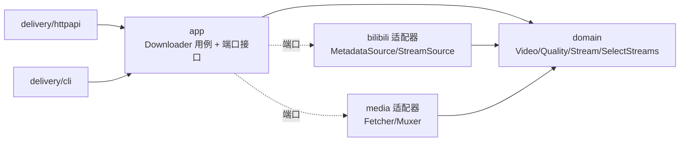

# bili2go

用 Go 实现的哔哩哔哩（Bilibili）DASH 视频下载器：解析视频真实播放地址，并发拉取分离的音/视频流，用 ffmpeg 合并为可播放的 MP4。提供 **CLI** 与 **HTTP API** 两种用法。

> 本项目仅供学习与研究，请遵守当地法律法规与 B 站用户协议，勿用于商业或大规模传播。

## 特性

- 解析 `bvid`/视频 URL → 元数据、分 P、DASH 播放清单
- 清晰度自动选择与**降级**（请求超出可用时回退到实际最高）
- 编码优选与回退：AVC(H.264) / HEVC(H.265) / AV1
- 音视频分离流并发下载 + 备用源（backupUrl）容灾
- ffmpeg `-c copy` 无损合并（不转码，秒级）
- CLI + HTTP API 双入口
- 多人友好：`serve` 内置并发限流（过载返回 429）与内容缓存/去重（命中秒回）——参数见 `serve -h`，设计见[技术设计](docs/tech-design/tech-design.md) §7.8/§7.9
- 零第三方依赖（仅 Go 标准库）

## 环境要求

- Go 1.24+
- [ffmpeg](https://ffmpeg.org/)（用于合并；`ffmpeg`、`ffprobe` 需在 PATH 中）
  - macOS: `brew install ffmpeg`

## 安装 / 构建

```bash
git clone {your-fork-url} bili2go && cd bili2go

# 方式一：构建出二进制到当前目录，然后用 ./bili2go 运行
go build -o bili2go ./cmd/bili2go
./bili2go info -bvid {BVID}

# 方式二：安装到 $GOBIN（在 PATH 中即可直接用 bili2go）
go install ./cmd/bili2go
bili2go info -bvid {BVID}
```

> `cmd/bili2go/` 是 Go 惯例的 main 包**源码**目录，不能直接执行；执行的是 `go build`/`go install` 产出的二进制。

## 使用

下面示例以 `go run` 直接运行源码（免构建）；若已构建/安装，把 `go run ./cmd/bili2go` 换成 `./bili2go` 或 `bili2go` 即可。

### CLI

```bash
# 查询可用清晰度与信息（把 {BVID} 换成真实 BV 号或视频页 URL）
go run ./cmd/bili2go info -bvid {BVID}

# 下载并合并为 mp4
go run ./cmd/bili2go dl -bvid {BVID} -qn 80 -codec avc -o out.mp4

# 多 P：用 -page 指定分 P
go run ./cmd/bili2go dl -bvid {BVID} -page 2 -o p2.mp4

# 启动 HTTP 服务
go run ./cmd/bili2go serve -addr :8090
```

`-bvid` 接受裸 `BV` 号或完整视频页 URL。占位符 `{BVID}` 仅为示例，请替换为真实值。

#### 子命令与参数

- `info`：查询可用清晰度与信息（不下载），支持 `-bvid -page -qn -codec -sessdata`
- `dl`：下载并合并 mp4，支持 `info` 的全部参数，外加**必填** `-o`
- `serve`：启动 HTTP 服务，支持 `-addr -sessdata`
- `analyze`：**下载后分析** —— 下载（或对 `-video` 本地文件）跑 `video-digest` 转写 + 画面关键字，再经摘要服务产出 `summary.md`（见下方「下载后分析」）

| 参数 | 适用 | 默认 | 含义 |
|---|---|---|---|
| `-bvid` | info, dl | 必填 | 视频 BV 号或视频页 URL |
| `-page` | info, dl | `1` | 分 P 序号（1 起） |
| `-qn` | info, dl | 可用最高 | **目标清晰度码**（见下方码表）；请求超出可用时自动降级到实际最高。`info` 下用于预览会选中的清晰度 |
| `-codec` | info, dl | `avc` | **期望视频编码**：`avc`(H.264) / `hevc`(H.265) / `av1`；该清晰度无此编码时按回退选择 |
| `-o` | **dl** | 必填 | **输出 mp4 文件路径**（仅 `dl`；`info` 不产出文件，传 `-o` 会报错） |
| `-addr` | serve | `:8090` | HTTP 监听地址（`host:port`） |
| `-sessdata` | 全部 | 环境变量 `BILI_SESSDATA` | 登录 Cookie SESSDATA，决定可下载的清晰度上限 |

### HTTP API

```bash
# 可用清晰度（把 {BVID} 换成真实 BV 号）
curl 'http://127.0.0.1:8090/api/info?bvid={BVID}'
# → {"bvid":"...","aid":...,"cid":...,"page":1,"title":"...","duration":213,
#    "current":{"qn":32,"name":"480P","codec":"AVC"},
#    "qualities":[{"qn":32,"name":"480P"},{"qn":16,"name":"360P"}]}
#   （示例为匿名，通常仅 ≤480P；配置 SESSDATA 后可出现 720P/1080P）

# 下载（浏览器直接访问即触发下载）；qn/codec 可选
curl -OJ 'http://127.0.0.1:8090/download?bvid={BVID}&qn=80&codec=avc'

# 自托管分析：下载 → whisper 转写 → 摘要 → 五节 summary.md（需 whisper.cpp + 摘要服务，见下）
curl -X POST 'http://127.0.0.1:8090/api/analyze?bvid={BVID}'
# → {"markdown":"## ① 一句话结论\n…（五节）","model":"fallback","fallback":true,
#    "title":"…","engine":"whisper","segments":42,"duration_s":93}
```

| 端点 | 参数 | 说明 |
|---|---|---|
| `GET /api/info` | `bvid`(必), `page`, `qn` | 返回清晰度与信息 JSON |
| `GET /download` | `bvid`(必), `qn`, `page`, `codec` | 回传合并后的 mp4（响应头含 `X-Bili-Quality`/`X-Bili-Codec`） |
| `POST /api/analyze` | `bvid`(必), `page`, `qn`, `codec` | 下载→转写→**画面 OCR**→摘要，返回五节 `summary.md` 的 JSON；重操作走限流（饱和 `429`）。转写需 `whisper.cpp`（`WHISPER_MODEL`）、画面关键字需 `tesseract`（缺则该项留空），加摘要服务（`cmd/summarizer` 或 docker）。serve `-keywords none\|unspoken\|all` 控 OCR；`-digest-bin` 可切 macOS `video-digest` |
| `POST /api/jobs` | `bvid`(必), `page`, `qn`, `codec` | **异步分析任务**（需 serve `-jobs-dir`）：入队并回 `202 {id,status}`，后台 worker 跑完 |
| `GET /api/jobs/{id}` | — | 查任务状态与结果（`queued`/`running`/`done`/`error` + `result`） |
| `GET /api/jobs` | `limit`, `q` | 列出最近任务（知识库浏览）；带 `q` 对已存 summary 全文检索 |

错误返回非 2xx + `{"code":<int>,"message":"<str>"}`。

**产物落盘说明**：`POST /api/analyze` **默认无状态**——下载的视频与 digest 产物写入系统临时目录
（`$TMPDIR/bili2go-az-*.mp4`、`$TMPDIR/bili2go-digest-*/`），**请求结束即删除**，响应只回 JSON。要保留：

- **服务端留存（推荐）** → 起 serve 时带 `-artifact-dir DIR`：每次请求把 `video.mp4` + `summary.md` + `digest.json`
  存到 `DIR/<bvid>[-p<page>]/`，响应额外回传 `video_path`/`summary_path`/`digest_path`。
  例：`bili2go serve -artifact-dir ~/bili2go-out -whisper-model ~/ggml-small.bin`。
  **复用**：同一 `bvid`（+`page`）二次请求命中已存产物直接返回（`"cached":true`），不再下载/转写、不占限流槽。
- 只要视频 → `GET /download`（把 mp4 回传给客户端）。
- 用 CLI 而非 HTTP → `analyze -bvid {BVID} -o video.mp4 -keep-video -digest-out out/`。

### 清晰度与登录态（SESSDATA）

清晰度码（qn）：`16=360P 32=480P 64=720P 80=1080P 112=1080P+ 120=4K …`

- **匿名**：通常仅能获取 ≤480P（B 站按登录态返回可下载的流集合）。
- **720P/1080P**：需提供登录 Cookie `SESSDATA`。
- 4K/HDR/杜比/8K（需大会员）为**非目标**，本项目不保证产出。

提供 SESSDATA：

```bash
export BILI_SESSDATA={你的SESSDATA}
go run ./cmd/bili2go dl -bvid {BVID} -qn 80 -o out.mp4
# 或给各子命令传 -sessdata {值}
```

## 下载后分析（analyze）

在下载能力之上叠加「下载 → 分析 → summary.md」链路：用 `video-digest`（Apple 原生离线工具）把视频离线拆成
带时间戳的口述转写 + 画面未口述关键字（`digest.json` / `transcript.md`），再由 LLM 摘要服务产出人读的
`summary.md`（固定五节，每条结论挂时间码）。

两条腿：

- **本地分析**：exec 宿主上的 `video-digest` 二进制（依赖 macOS 原生 AVFoundation/Speech/Vision，**不进 Docker**）。
- **LLM 摘要**：`deploy/` 下的 Docker 服务，接 OpenAI 兼容端点；未配置 LLM 时走**确定性模板回退**，离线可跑。

> 分析链路是外围能力，落在 `internal/analyze`，仅用 Go 标准库（`os/exec` + `net/http`）；LLM 依赖下沉到
> Docker，核心 domain/app 仍零第三方依赖。

```bash
# 1) 起摘要服务（Docker）。不配 LLM 走回退；配 LLM 见 deploy/docker-compose.yml 注释。
cd deploy && docker compose up -d --build && cd ..

# 2a) 对已下载的本地视频分析
go run ./cmd/bili2go analyze -video out.mp4 \
  -digest-bin /path/to/video-digest/bin/video-digest

# 2b) 给 bvid：先下载再分析（-o 省略则下载到临时文件，分析后删除，除非 -keep-video）
go run ./cmd/bili2go analyze -bvid {BVID} -qn 32 \
  -digest-bin /path/to/video-digest/bin/video-digest -keep-video -o out.mp4
# → 产物：<stem>.digest/{digest.json, transcript.md, summary.md}；stdout 打印 summary.md 路径
```

| 参数 | 默认 | 含义 |
|---|---|---|
| `-video` | — | 分析本地视频（跳过下载）；与 `-bvid` 二选一 |
| `-digest-bin` | `$VIDEO_DIGEST_BIN`→PATH | `video-digest` 二进制路径 |
| `-summarizer` | `$BILI_SUMMARIZER_URL`→`http://127.0.0.1:8091` | 摘要服务地址 |
| `-summarizer-token` | `$BILI_SUMMARIZER_TOKEN` | 摘要服务 token（服务端设 `SUMMARIZER_TOKEN` 时必填） |
| `-lang` / `-keywords` | `zh-CN` / `unspoken` | 转写 locale / 画面关键字模式（`unspoken`\|`all`） |
| `-digest-out` / `-top` | `<stem>.digest/` / `25` | 产物目录 / 摘要取前 N 关键字 |
| `-keep-video` | 关 | 保留下载的视频（默认下载到临时文件并删除） |

需求与契约见 [PRD-analyze](docs/prd/PRD-analyze.md) 与 [tech-design-analyze](docs/tech-design/tech-design-analyze.md)。

## 架构

领域中心 + 端口适配器（轻量六边形）：依赖只向内指向领域，领域不依赖任何基础设施。



```
cmd/bili2go/           组合根（装配依赖、启动 CLI/HTTP）
internal/
  domain/              领域层：纯类型 + 统一语言 + SelectStreams（零 IO，可脱网单测）
  app/                 应用层：Downloader 用例 + 端口接口
  bilibili/            适配器：HTTP Client、view/playurl（B 站 DTO 止于本包，防腐层）
  media/               适配器：并发下载 + ffmpeg 合并
  delivery/{httpapi,cli}  交付层
scripts/verify.sh      端到端验证
docs/                  PRD / 技术设计（可发布设计文档）
```

详见 [docs/tech-design/tech-design.md](docs/tech-design/tech-design.md) 与 [docs/prd/PRD.md](docs/prd/PRD.md)。

## 开发与测试

```bash
go test ./...            # 单元测试
go test -race ./...      # 竞态检测
go vet ./...
./scripts/verify.sh {BVID}   # 端到端：info→下载→ffprobe 断言音视频双流
```

## 限制 / 非目标

- 仅 DASH 格式（不含 FLV/durl）
- 不含番剧/PGC、弹幕、字幕、封面
- 4K/HDR/杜比/8K（大会员）不保证
- `/download` 首版为「合并后回传」，暂未实现 Range 分片（拖动/秒开）

## 路线图

- [x] 核心下载：解析 + DASH 选流/降级/编码回退 + 并发下载 + ffmpeg 合并（CLI / HTTP）
- [x] WS-A 并发治理：`/download` 限流、429/Retry-After、取消传播、优雅关闭
- [x] WS-C 缓存 / 去重：磁盘 LRU 缓存 + single-flight（命中秒回）
- [x] WS-G 下载后分析：`analyze` 子命令（video-digest 转写/画面关键字 + Docker LLM 摘要 → `summary.md`）
- [ ] WS-D 鉴权与配额（多人开放部署）
- [ ] WS-B 流式回传 / Range（拖动、秒开）
- [ ] WS-E 登录态高清 / 4K·HDR（需 SESSDATA / 大会员）
- [ ] WS-F 可观测：Prometheus `/metrics`（压测与问题发现的前置）

已发布变更见 [CHANGELOG.md](CHANGELOG.md)。

## 免责声明

本项目仅用于技术学习与研究。使用者须遵守中华人民共和国相关法律法规及哔哩哔哩用户协议，对下载内容的版权负责。作者不对任何滥用行为负责，亦不提供任何商业或非法用途的技术支持。

## License

[MIT](LICENSE)

## 贡献与变更

- 贡献指南:[CONTRIBUTING.md](CONTRIBUTING.md)(TDD、领域中心架构、Conventional Commits)
- 变更记录:[CHANGELOG.md](CHANGELOG.md)
