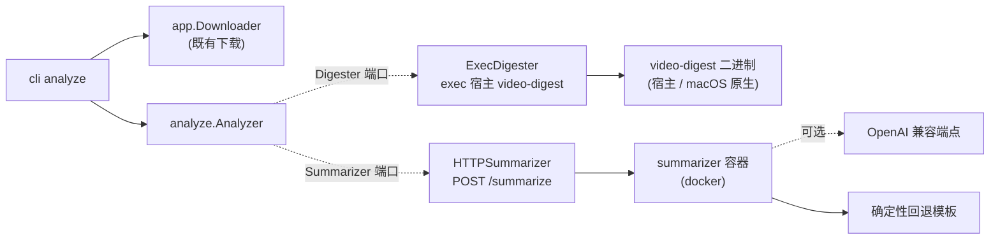

# 技术设计 — 下载后分析（Analyze）链路

| 项 | 内容 |
|---|---|
| 关联 PRD | `docs/prd/PRD-analyze.md` |
| 状态 | 已实现，端到端验收通过 |
| 日期 | 2026-09-09 |

## 1. 架构总览

沿用领域中心 + 端口适配器。分析链路是**外围能力**，落在独立包 `internal/analyze`，不侵入核心
`domain`/`app`。编排由 CLI `analyze` 子命令完成，下载步骤复用既有 `app.Downloader`。



数据流：`视频 → (ExecDigester) digest.json → (HTTPSummarizer) markdown → 写 <stem>.digest/summary.md`。

## 2. Docker 边界（关键设计）

| 组件 | 落点 | 原因 |
|---|---|---|
| `video-digest`（转写 + 画面 OCR 关键字） | **宿主** | 依赖 macOS 原生框架 AVFoundation/Speech/Vision，不可容器化 |
| LLM 摘要服务 `summarizer` | **Docker** | 可容器化、可离线回退；把 LLM 依赖挡在 bili2go 核心之外 |
| bili2go（`analyze` 编排） | 宿主进程 | 同时 exec 宿主 `video-digest` + HTTP 调用容器服务，两跳 |

`deploy/docker-compose.yml` 只承载 `summarizer` 一个服务，注释显式说明「video-digest 为何不进容器」。

## 3. 端口与适配器（`internal/analyze`）

- **端口**（`analyze.go`）：
  - `Digester.Digest(ctx, videoPath, outDir) (DigestOutput, error)` —— 产出 `digest.json`。
  - `Summarizer.Summarize(ctx, digestJSON) (Summary, error)` —— digest → markdown。
  - `Analyzer.Analyze(ctx, videoPath, outDir) (Report, error)` —— digest → summarize → 写 `summary.md`。
- **适配器**：
  - `ExecDigester`（`digest.go`）：`exec.CommandContext(bin, video, --out, --lang, --keywords…)`；读回
    `<outDir>/digest.json`，`parseMeta` 取最小展示字段（时长/音轨/引擎/段数/关键字数/gaps 数）；
    digest.json **原始字节原样转发**给摘要服务，不重序列化。
  - `HTTPSummarizer`（`summarizer.go`）：`POST <BaseURL>/summarize?top=N`，解析 `{markdown,model,fallback,reason}`；
    非 2xx 透传服务 `error`。默认 120s 超时。

产物目录口径 `DefaultDigestDir` 复刻 video-digest：`<video 同目录>/<stem>.digest/`。

## 4. 冻结契约

### 契约 A — CLI `analyze`

```
bili2go analyze (-bvid <BV|url> [-o out.mp4] | -video <path>)
  [-page N] [-qn 80] [-codec avc] [-sessdata …]
  [-digest-bin PATH]     # 默认 $VIDEO_DIGEST_BIN，否则 PATH 中的 video-digest
  [-summarizer URL]      # 默认 $BILI_SUMMARIZER_URL，否则 http://127.0.0.1:8091
  [-lang zh-CN] [-keywords unspoken] [-digest-out DIR] [-top 25] [-keep-video]
```

行为：`-video` 跳过下载；否则下载（`-o` 空时下载到临时文件，分析后删除，除非 `-keep-video`）。
stdout 打印 `summary.md` 路径；stderr 打印分析元信息。退出码：0 成功 / 1 运行错误 / 2 用法错误。
产物：`<digest-out>/{digest.json, transcript.md, summary.md}`。

前置探活：下载/digest 之前先 `GET <summarizer>/health`（5s 超时），服务不可用即快速失败并提示启动命令，避免白跑昂贵的下载 + 转写（requirement-orchestrator target-system preflight）。

### 契约 B — VideoDigester（exec，宿主）

`video-digest <videoPath> --out <dir> --lang <lang> --keywords <mode>`；退出 0 成功
（2=输入不可读，3=环境/资产不可用）；适配器读 `<dir>/digest.json`。

### 契约 C — Summarizer 服务（docker，HTTP）

- `GET /health` → `200 {"status":"ok","llm":<bool>}`。
- `POST /summarize[?top=N]`，body = `digest.json`（`application/json`）：
  - `200 {"markdown","model","fallback"[,"reason"]}`。
  - `400 {"error"}` 当 digest 非法 JSON 或缺 `source/transcript/screen_keywords/gaps`。
- 环境变量：`OPENAI_BASE_URL` / `OPENAI_API_KEY` / `OPENAI_MODEL`（默认 gpt-4o-mini）/ `SUMMARY_TOP`（默认 25）。
  配置 LLM 则走 `/v1/chat/completions`，失败回退模板并置 `fallback:true` + `reason`；未配置直接回退。
- 端口 8091（容器内外一致）。

## 5. 摘要纪律（服务侧）

`summarize.py` 系统提示词与回退模板都遵循 video-digest SKILL.md「AI 摘要流程」五节 + 纪律：
时间码来自 `segments[].start_s`；第③节按 `score` 降序落表；`gaps` 原样展开、空则写「无缺口」；
无口述数据（`engine==none` 或无段）时第②④节写「无口述内容」，禁止用画面文字反推口述；数字只来自 digest。

## 6. 测试与验收

- Go：`internal/analyze/analyze_test.go` —— Analyzer 用 fake 端口验证「digest 原样转发 + summary.md 落盘 +
  Report 元信息」；`HTTPSummarizer` 对 `httptest` 服务器验证 round-trip 与错误透传；`parseMeta` 无音轨用例。
- Python：`deploy/summarizer/test_summarize.py` —— 回退在真实 fixture digest 上产出合规五节（节标题、
  时间码、关键字入表且按 score 降序、gaps 原样/空缺口、无音轨不编造、字段校验拒绝非法 digest）。
- 端到端：真实 `video-digest`（宿主）+ docker `summarizer` + `bili2go analyze -video` → `summary.md`。

## 7. 备选与取舍

- **让 Go 直接写 summary.md 而非走服务**：否。LLM 依赖会污染核心；服务边界让 LLM 可离线回退、可独立演进。
- **把 digest 解析成完整 Go 结构再转发**：否。只解析展示所需最小字段，原始字节原样 POST，避免 schema 漂移。
- **把 video-digest 也塞进容器**：不可行，macOS 原生框架无法容器化（PRD 硬约束）。
