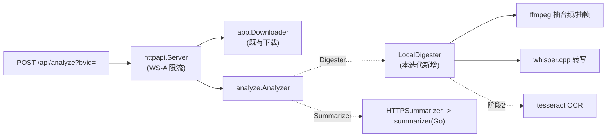

# 技术设计 — 自托管分析服务（whisper + HTTP analyze）

| 项 | 内容 |
|---|---|
| 关联 PRD | `docs/prd/PRD-self-hosted-analyze.md` |
| 状态 | 阶段 1（转写）已实现，本地端到端验证通过；OCR 阶段 2 |
| 日期 | 2026-09-17 |
| builds_on | 迭代 4（analyze 链路）、5（鉴权）、6（Go summarizer） |

## 1. 架构总览

复用领域中心 + 端口适配器：`analyze.Analyzer` 编排不变，只**换 `Digester` 适配器**（video-digest →
LocalDigester），并把 analyze 链路从 CLI **补一条 HTTP 入口**。所有重活（下载/转写/摘要）在服务端。



数据流：`bvid → 下载 mp4 → LocalDigester(ffmpeg+whisper[+ocr]) digest.json → summarizer markdown → HTTP 200`。

## 2. LocalDigester（`internal/analyze/localdigest.go`）

实现既有端口 `Digest(ctx, videoPath, outDir) (DigestOutput, error)`，与 `ExecDigester` 平行。步骤：

1. **探测**（ffprobe）：`duration_s`、`width/height`、`has_audio`。无音轨 → 直接 `engine="none"`，转写留空（RS5）。
2. **抽音频**（ffmpeg）：`ffmpeg -i <video> -vn -ac 1 -ar 16000 -f wav <tmp>.wav`（whisper 要 16k 单声道）。
3. **转写**（whisper.cpp）：`whisper-cli -m <model> -f <wav> -oj -of <out>`（`-oj` 出 JSON）；解析
   `transcription[].offsets.from`（ms）→ `start_s`，`text` → segment。`engine="whisper"`，`locale` 取自
   `-l` 参数（默认 `zh` 或配置）。
4. **阶段 2 · 画面关键字**（tesseract）：ffmpeg 按 `fps` 抽帧 → 每帧 `tesseract <frame> - -l chi_sim+eng`；
   聚合去重、按出现次数/位置打分、`is_chrome`（跨多帧常驻 = 界面装饰）、`spoken_in_transcript`（term 命中转写）。
   阶段 1 此步跳过，`screen_keywords=[]`。
5. **组装 digest.json**：Go struct（明确字段，非 `map`）序列化为**与摘要消费方逐字兼容**的 schema；写 `outDir/digest.json`，
   复用 `parseMeta` 出 `DigestMeta`，返回 `DigestOutput`。

外部二进制经配置：`FFmpegBin`/`WhisperBin`/`WhisperModel`（默认 `ffmpeg`/`whisper-cli`/`$WHISPER_MODEL`）。
exec 一律 `exec.CommandContext`（承接既有取消/超时约定）。

### whisper JSON → segment 映射（契约，桩可测）

```
whisper -oj: { "transcription": [ { "offsets": {"from": <ms>, "to": <ms>}, "text": "..." }, ... ] }
=>  transcript.segments[i] = { start_s: from/1000, end_s: to/1000, text: trim(text) }
    transcript.engine = "whisper";  空转写 => engine="none", segments=[]
```

## 3. HTTP 端点（`internal/delivery/httpapi`）

- 新增路由 `POST /api/analyze`，参数 `bvid`(必填)、`page`/`qn`/`codec`(可选，同 /download)。
- 处理：校验 → **WS-A 限流 Acquire**（重操作，同 /download）→ 下载到临时 mp4 → `Analyzer.Analyze` →
  返回 `200 application/json {markdown, model, fallback, reason?, title, cid, page, chosenQuality, codec}`。
- 缺 bvid → `400`；饱和/超时 → `429 + Retry-After`（复用现有中间件）；客户端断开 → ctx 取消中止全链路。
- 装配（`Server`）新增依赖：`*analyze.Analyzer`（内含 Digester + Summarizer）。`cmd/bili2go` serve 装配 LocalDigester +
  HTTPSummarizer（URL/token 来自 env）。CLI `analyze` 装配不变（可选 mac video-digest）。
- 缓存（WS-C）：本迭代**不**给 analyze 加缓存（键含分析参数、产物大、优先正确性）；记为后续。

## 4. 部署（`deploy/`）

- **bili2go 镜像**（新增 `deploy/bili2go/Dockerfile`，多阶段）：`golang` 构建 `bili2go` → 运行镜像基于
  `debian-slim`（非 distroless：需 `ffmpeg`+`whisper.cpp`+模型+阶段2 `tesseract`）。构建期 `apt-get install ffmpeg`，
  编译/下载 `whisper.cpp` 与 ggml 模型到镜像。
- **docker-compose**：两服务——`bili2go`（serve，`:8090`，env `BILI_SUMMARIZER_URL=http://summarizer:8091`、
  `WHISPER_MODEL`、可选 `BILI_SESSDATA`/`SUMMARIZER_TOKEN`）+ `summarizer`（既有）。同一 compose 网络互通。
- 镜像会显著变大（ffmpeg+模型），属自托管固有成本；distroless 只适合纯二进制的 summarizer，bili2go 分析镜像需系统包。

## 5. 测试与验收

- **单元**：`localdigest_test.go` —— whisper `-oj` JSON（fixture 桩，不跑真 whisper）→ digest.json 映射断言；
  ffprobe 探测用短样例或桩；无音轨分支 → `engine=none`（ACS2/ACS4）。
- **HTTP**：`server_test.go` 加 `/api/analyze` —— fake Analyzer 验 200 契约字段、缺 bvid 400、饱和 429（ACS1/ACS4）。
- **单语言**：`git ls-files '*.py'` 无新增；`go build/vet/test ./...` 全绿（ACS3）。
- **部署冒烟**：`docker compose up` 后宿主 `POST /api/analyze?bvid=<BV>` → 200 + 五节 markdown（ACS1/RS4）。
  真 whisper 转写在容器内验一次（模型小、短视频）。

## 6. 备选与取舍

- **whisper 做成独立 HTTP 服务（像 summarizer）**：否。转写是 exec 一次性批处理，无需常驻服务；Go 适配器直接
  exec `whisper-cli` 更简单、少一跳、少一个部署单元。（若将来要 GPU 池化，再抽服务。）
- **OCR 用 PaddleOCR（Python 服务）**：否（默认）。会重新引入 Python 源，违背单语言。先用 `tesseract`(exec)；
  中文屏幕字质量不足时再评估把 OCR 单独抽成服务（记入 gaps）。
- **digest 组装用 `map[string]any`**：否。这里我们是**生产方**，schema 固定，强类型 struct 更安全（与 summarizer
  消费方用 map 的取舍相反——生产端固定、消费端宽容）。
- **给 /api/analyze 上缓存**：本迭代否。产物大、键含多参数，先保正确性与可部署，缓存作后续迭代。
- **bili2go 镜像用 distroless**：否。分析链路需系统级 `ffmpeg`/`whisper`/`tesseract`，用 `debian-slim`；
  summarizer 仍 distroless（纯二进制）。
