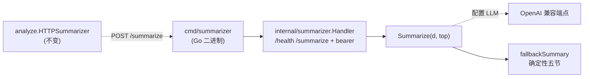

# 技术设计 — summarizer 单语言化（Go 重写）

| 项 | 内容 |
|---|---|
| 关联 PRD | `docs/prd/PRD-summarizer-go.md` |
| 状态 | 规格冻结，待 execute |
| 日期 | 2026-09-16 |
| builds_on | 迭代 4（analyze 链路）、迭代 5（WS-D 鉴权） |

## 1. 架构总览

把 Python 摘要服务（`app.py` + `summarize.py`）直译为 Go，落在 `internal/summarizer`（逻辑）+
`cmd/summarizer`（入口），与既有 `internal/*` + `cmd/bili2go` 同构。**服务边界与 HTTP 契约不变**：
仍是独立进程、独立容器、可离线回退。上游 `internal/analyze/HTTPSummarizer` 是纯 HTTP 消费方，**零改动**。



数据流不变：`digest.json → Handler(鉴权/校验) → Summarize → {markdown,model,fallback} → analyze 写 summary.md`。

## 2. 落点与布局

| 文件 | 对应 Python | 职责 |
|---|---|---|
| `internal/summarizer/summarize.go` | `summarize.py` | `Digest` 类型、`validate/clock/partition/buildBrief/fallbackSummary/callLLM/Summarize` |
| `internal/summarizer/server.go` | `app.py` | `Handler`：`/health`、`/summarize`、bearer 鉴权、错误码、body 上限 |
| `cmd/summarizer/main.go` | `app.py::main` | `serve`（默认）+ `health` 子命令 |
| `internal/summarizer/testdata/` | `deploy/summarizer/testdata/` | 迁入 fixture + 新增 golden |
| `deploy/summarizer/Dockerfile` | 同名（Python） | 改 Go 多阶段静态构建 |

决策：Go 源不放 `deploy/`（那是部署工件目录），与 `cmd/bili2go`/`internal/*` 保持同构。

## 3. 冻结契约（与迭代 4/5 逐字一致）

### 契约 A — HTTP

```
GET  /health            -> 200 {"status":"ok","llm":<bool>}         # llm = OPENAI_BASE_URL && OPENAI_API_KEY 均非空
POST /summarize[?top=N] -> body=digest.json
    200 {"markdown","model","fallback"[,"reason"]}
    400 {"error"}   # 非法 JSON / 缺必需字段 / top 非整数 / Content-Length 非法或超限(64MiB)
    401 {"error":"unauthorized"} + WWW-Authenticate: Bearer realm="summarizer"   # 仅当设 SUMMARIZER_TOKEN 且缺/错
    404 {"error":"not found"}    # 其它路径
```

- 鉴权：`SUMMARIZER_TOKEN` 未设 → 放行；已设 → `/summarize` 要 `Authorization: Bearer <token>`，
  `crypto/subtle.ConstantTimeCompare` 恒定时间比较；`/health` 永放行。
- 缺字段错误串复刻 Python：`digest 缺少必需字段: ['transcript', 'screen_keywords', 'gaps']`（Python list repr，保 F2 观测口径）。

### 契约 B — Go API（包内 + 供测试）

```go
type Result struct { Markdown, Model string; Fallback bool; Reason string }
func Summarize(d map[string]any, top int) (Result, error)   // 校验失败 → ErrInvalid（Handler 映射 400）
var ErrInvalid = errors.New(...)                            // 携带缺字段消息
```

### 契约 C — env

`OPENAI_BASE_URL` / `OPENAI_API_KEY` / `OPENAI_MODEL`(默认 `gpt-4o-mini`) / `SUMMARY_TOP`(默认 25) /
`SUMMARIZER_TOKEN`(可空) / `PORT`(默认 8091)。

## 4. 详设：直译要点（parity 关键）

- **digest 解析**：Python 用动态 dict。Go 用 `map[string]any` + 小取值助手（`getStr/getFloat/getSlice`），
  **不**建强类型 struct——避免 schema 漂移，且 `screen_keywords`/`segments` 字段可选性与 Python `.get()` 对齐。
- **`clock(s)`**：`int(float(s))` 截断后 `%02d:%02d`。Go：`int(toFloat(s))` 同为向零截断（正数与 Python 一致），
  `fmt.Sprintf("%02d:%02d", s/60, s%60)`。
- **`has_spoken`**：`engine ∉ {"", "none"}` 且 `len(segments) > 0`。
- **`partition`**：unspoken/spoken/chrome 三分；unspoken 按 `score` 降序。Go `sort.SliceStable` **稳定**排序，
  与 Python `list.sort`（稳定）一致，保并列项顺序不漂。
- **`fallbackSummary` 逐字**：`out []string` 逐段 append，元素 join `"\n"` 末尾 `+ "\n"`；②④⑤ 段首元素带前导
  `"\n"` 形成空行。证据帧 `fmt.Sprintf("frames/f%05d.jpg", i)` 取前 3，`、` 连接，空则 `(无)`。
- **`occurrences`/`score` 打印**：回退表只用 `occurrences`（整数，`%d`——注意 JSON 数字在 `map[string]any` 里是
  `float64`，需按整数格式化，与 Python 一致）。`score` 仅出现在 `buildBrief`（LLM 路径）。
- **`callLLM`**：`net/http` POST `base+/chat/completions`，body `{model,temperature:0,messages:[system,user]}`，
  头 `Authorization: Bearer <api_key>`，取 `choices[0].message.content` `TrimSpace` + `"\n"`。失败（网络/解析/结构）
  → 回退 + `reason = "LLM 调用失败，已回退确定性模板: " + err`。

## 5. parity 策略（RG1 的可测锚点）

1. execute 前用**现 Python** 对 `digest.fixture.json`、`digest.silent.json` 各跑一次 `summarize.fallback_summary`，
   固化为 `testdata/summary.fixture.golden.md` / `summary.silent.golden.md`。
2. Go `summarize_test.go` 读同名 fixture → `Summarize(d,25)` → 与 golden **字节比较**（`if got != want { t.Error }`）。
3. golden 由 Python 生成、Go 校验：任一格式漂移测试即红。这是「直译无损」的机械证据。
4. 迁移迭代 5 的 `test_app_auth.py` 五例为 `server_test.go`（401/wrong/correct/health-open/no-token）。

## 6. 部署

- **Dockerfile**（多阶段）：`FROM golang:1.24 AS build` → `CGO_ENABLED=0 go build -trimpath -o /out/summarizer ./cmd/summarizer`
  → `FROM gcr.io/distroless/static` → `COPY --from=build`。镜像内**无 Python、无 shell**，静态二进制。
- **HEALTHCHECK**：distroless 无 shell，故用二进制自身 `summarizer health`（GET 本机 `/health`，200→exit0）。
- **compose**：`build.context: ..`（仓根，Go 源在 `cmd/`+`internal/`），`build.dockerfile: summarizer/Dockerfile`；
  env 增删不变（沿用 `SUMMARIZER_TOKEN` 等）。
- **构建上下文**：`.dockerignore` 排除 `bili2go` 产物二进制、`.ai-work/`、`docs/` 等，缩小上下文。

## 7. 备选与取舍

- **保留 Python，只加维护约定**：否。多语言的 CI/镜像/测试 runner/认知成本是持续支出；零三方依赖使 Go 直译近乎无损，
  一次性成本换长期单语言。
- **强类型 struct 解析 digest**：否。Python 动态 `.get()` 语义 + 可选字段多，`map[string]any` + 助手更贴原行为、防漂移。
- **把摘要塞回 Go 核心（不要独立服务）**：否。会污染 `domain/app` 零依赖、丢独立部署/离线回退（迭代 4 已否决），
  本迭代只换语言不拆边界。
- **重写而非直译（借机改五节措辞）**：否。parity 是硬需求；措辞变更是另一个需求，不混入。
- **Go 源放 `deploy/summarizer/`**：否。与 `cmd/`+`internal/` 布局不一致；`deploy/` 只留 Dockerfile/compose 部署工件。

## 8. 测试与验收

- **parity**：`summarize_test.go` golden 对拍（fixture + silent），覆盖节标题/时间码/关键字降序/gaps/静音（ACG1/ACG4）。
- **契约 + 鉴权**：`server_test.go`（httptest）覆盖 /health、/summarize 合法/非法/缺字段/top/404、401/对错 token（ACG2/ACG3）。
- **单语言 + 部署**：`git ls-files 'deploy/**/*.py'` 为空；`docker compose up -d --build` 起容器、`/health` 健康（ACG5）。
- **回归**：`go build/vet/test ./...` 全绿；`internal/analyze` 既有测试不改仍绿（契约未漂）。
