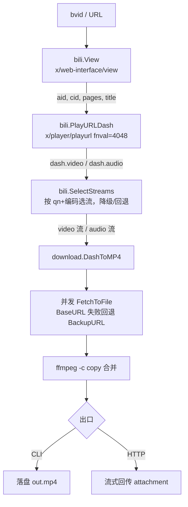
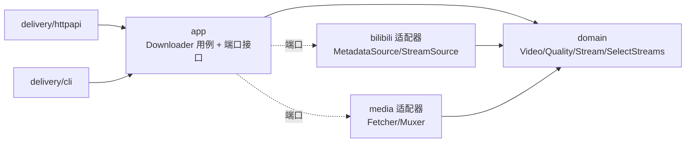
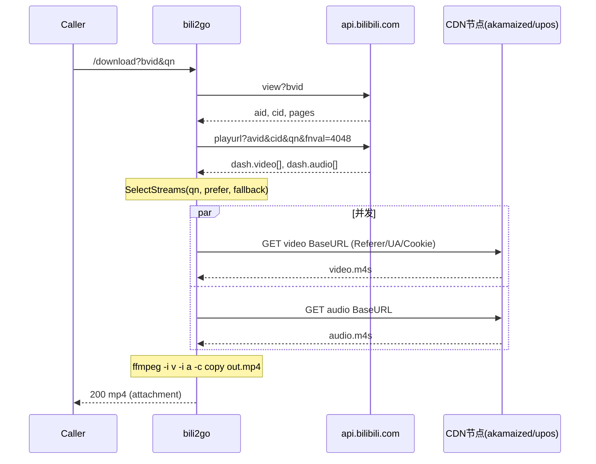

# 技术设计文档 (TDD) — bili2go

## 0. 文档信息

| 项 | 内容 |
|---|---|
| 标题 | bili2go：Bilibili DASH 视频下载器技术设计 |
| 作者 | Main (Claude, requirement-orchestrator) |
| 状态 | Draft · 待评审 |
| 版本 | v0.4 |
| 创建日期 | 2026-09-03 |
| 关联 PRD | `docs/prd/PRD.md` |
| 关联台账 | `.ai-work/ledger.md`（内部工件，不发布） |
| 关联计划 | `.ai-work/plan.md`（内部工件，不发布） |
| 评审人 | 用户 |

## 1. 背景与问题陈述

参考项目 `you2php`（PHP）通过"抓 watch 页 HTML → 逆向 JS 签名 → socket 透传字节"实现 YouTube 视频代理下载。本项目将该能力用 Go 重写，目标平台改为哔哩哔哩（Bilibili）。

核心问题：Bilibili 的 DASH 格式将音频、视频拆成两路独立流，官方 `playurl` 接口返回各自的 CDN 地址；直接透传单流的旧模型（you2php）不再适用，须**分别下载再合并**。同时 CDN 有请求头校验、清晰度有登录/会员门槛。

本文档描述如何在 Go 中稳定获取 DASH 流并产出可播放 mp4。需求与验收标准见 PRD，本文不重复，仅在必要处引用。

## 2. 目标与非目标

**目标**（摘要，详见 PRD R1–R6）：枚举清晰度、DASH 下载并合并成可播 mp4、认证分级与降级、多 P、编码优选回退、HTTP+CLI 双触发。

**非目标**：4K+/大会员清晰度、FLV/durl、番剧 PGC、弹幕字幕、登录流程、UI 美化、wbi 签名（条件性，见 §6 备选方案与 §11 G2）。

## 3. 术语表

| 术语 | 含义 |
|---|---|
| bvid | B 站视频字符串 ID，形如 `BV1xx411c7mD` |
| aid | 视频数字 ID（avid），playurl 用 |
| cid | 分 P 的流 ID，一个 bvid 每个分 P 一个 cid |
| qn | 清晰度码（quality number），如 80=1080P |
| DASH | 音视频分离的自适应流格式（MPEG-DASH），分片扩展名 `.m4s` |
| durl/FLV | 音视频合一的单文件格式（本期非目标） |
| fnval | playurl 的功能位掩码，`4048` 启用 DASH+4K+HDR+杜比+8K+AV1 |
| SESSDATA | B 站登录态 cookie，决定可获取的清晰度上限 |
| codecid | 编码标识：7=AVC/H.264，12=HEVC/H.265，13=AV1 |
| AVC / HEVC / AV1 | 视频编码标准。AVC=H.264（兼容性最好，codecid=7）；HEVC=H.265（更高压缩，codecid=12）；AV1（新一代开放编码，codecid=13） |
| HDR / 杜比视界(Dolby Vision) | 高动态范围 / 杜比高级 HDR，属大会员清晰度（qn≥125，本期非目标） |
| FLAC | 无损音频编码，对应 `dash.flac`（本期忽略） |
| mux（封装 / 合流） | 把独立的视频流与音频流封装进同一容器（mp4）；`ffmpeg -c copy` 只封装不重新转码 |
| wbi | B 站 Web 接口的一种请求签名机制：从 `nav` 接口取 `img_key`/`sub_key`，按固定表 mixin 重排后 md5 生成 `w_rid` 签名参数。普通端点不需要，仅风控严格的接口才需要 |
| CDN（内容分发网络） | 就近分发视频字节的边缘服务器（如 `*.akamaized.net`、upos 节点）；playurl 返回的 `baseUrl`/`backupUrl` 指向它 |
| PGC | Professional Generated Content，B 站指番剧/影视等版权内容，走 `pgc/player/web/playurl`（本期非目标） |
| SSRF | 服务端请求伪造（Server-Side Request Forgery）；须校验入参只允许 bilibili 域名，防止被诱导请求内网资源 |
| TDD / RFC | Technical Design Document / Request for Comments，本文遵循的技术设计文档结构 |

### 3.1 标识前缀约定

文档内的编号前缀含义，便于跨文档追溯（PRD ↔ 本文 ↔ ledger ↔ plan）：

| 前缀 | 全称 / 含义 | 枚举位置 |
|---|---|---|
| R# | Requirement，需求 | PRD §3 |
| AC# | Acceptance Criteria，验收场景 | PRD §4 |
| T# | Task，实现任务 | 本文 §9 / plan / ledger |
| M# | Milestone，里程碑（一组任务） | 本文 §9 |
| G# | Gap，开放问题 / 缺口（待验证或待外部输入的未决项） | 本文 §11 / ledger `gaps` |
| OQ# | Open Question，设计层未决选择 | 本文 §11 |

## 4. 方案概览



架构风格：分层单体。`bili`（领域/上游对接）→ `download`（IO/合并）→ `cmd`+`server`（入口）。无数据库、无状态，单进程。

## 5. 详细设计

### 5.1 目录结构

```
bili2go/
├── go.mod                        module bili2go
├── cmd/bili2go/
│   └── main.go                   组合根：解析 flag、装配依赖、启动 CLI/HTTP
├── internal/
│   ├── domain/                   领域层（纯，无 IO；统一语言）
│   │   ├── video.go              Video 聚合、Page 值对象
│   │   ├── quality.go            Quality 值对象、qn 码表、Codec 枚举
│   │   ├── stream.go             Stream/Manifest 值对象、SelectStreams 纯领域逻辑
│   │   └── errors.go             领域错误（ErrQualityUnavailable 等）
│   ├── app/                      应用层：用例编排 + 端口(接口)定义
│   │   ├── downloader.go         Downloader 用例：bvid→解析→选流→下载合并
│   │   └── ports.go              MetadataSource/StreamSource/Fetcher/Muxer 接口
│   ├── bilibili/                 基础设施：B站适配器（防腐层，DTO→domain）
│   │   ├── client.go             http.Client + Referer/UA/Cookie 注入
│   │   ├── metadata.go           实现 MetadataSource：view → domain.Video
│   │   ├── playurl.go            实现 StreamSource：playurl → domain.Manifest
│   │   └── dto.go                B站 JSON DTO（仅本包可见，不外泄）
│   ├── media/                    基础设施：下载与合并
│   │   ├── fetcher.go            实现 Fetcher：并发下载 + backup 回退
│   │   └── ffmpeg.go             实现 Muxer：ffmpeg -c copy
│   └── delivery/
│       ├── httpapi/server.go     HTTP handlers（依赖 app.Downloader）
│       └── cli/cli.go            子命令 info/dl/serve（依赖 app.Downloader）
└── scripts/verify.sh             端到端验证
```

### 5.1.1 架构分层与依赖方向

采用「领域中心 + 端口适配器（轻量六边形）」。依赖只能由外向内指向领域，领域不依赖任何基础设施：



- **domain**：统一语言与纯业务规则（选流/降级/回退），零 IO、可脱网单测。
- **app**：编排用例，并按 Go 惯例「消费方定义接口」声明端口；`main` 注入具体实现。
- **bilibili / media**：适配器，实现端口；B站 JSON DTO 止于 `bilibili` 包内（防腐层），映射为 domain 类型后再向内传，避免 `codecid=7`/`baseUrl` 泄漏进领域。
- 取舍：止步于「领域模型 + 用例 + 端口/适配器」，不引入仓储/事件总线/CQRS——对无状态下载器属过度设计（见 §6）。

### 5.2 数据模型（领域 vs DTO）

领域层为纯类型，只讲统一语言，不含任何 B 站/HTTP 细节：

```go
// internal/domain
type Page   struct { CID int64; Index int; Title string; Duration time.Duration }
type Video  struct { AID int64; BVID, Title string; Pages []Page }

type Codec    int                 // AVC / HEVC / AV1（领域枚举，非 codecid 整数）
type Quality  struct { QN int; Name string }
type StreamKind int               // Video | Audio

type Stream struct {              // 一路视频或音频流（值对象）
    Kind      StreamKind
    Quality   Quality             // video 有意义
    Codec     Codec
    BandWidth int
    URLs      []string            // 主源+备源，已归一 https（领域不关心谁是 backup）
    Duration  time.Duration
}
type Manifest struct {            // 一个 cid 的可选流集合
    Available []Quality
    Videos    []Stream
    Audios    []Stream
}
```

应用层以端口（接口）依赖基础设施，便于 mock 单测：

```go
// internal/app
type MetadataSource interface { View(ctx context.Context, bvid string) (domain.Video, error) }
type StreamSource   interface { Manifest(ctx context.Context, aid, cid int64, qn int) (domain.Manifest, error) }
type Fetcher        interface { Fetch(ctx context.Context, urls []string, dst string) error }
type Muxer          interface { Mux(ctx context.Context, videoPath, audioPath, dst string) error }
```

- B 站 API 的 JSON（`code/data/dash/baseUrl/codecid`…）作为 **DTO 只存在于 `internal/bilibili`**，由适配器映射为上述 domain 类型（防腐层）；domain 与 app 永不 import B 站 DTO。

### 5.3 上游接口契约（Bilibili）

**5.3.1 元数据 View**
- `GET https://api.bilibili.com/x/web-interface/view?bvid=<bvid>`
- 关键返回：`data.aid`、`data.title`、`data.pages[]{cid,page,part,duration}`。
- 错误：`code != 0` 视为失败，携带 `message`。

**5.3.2 播放地址 PlayURL（DASH）**
- `GET https://api.bilibili.com/x/player/playurl?avid=<aid>&cid=<cid>&qn=<qn>&fnval=4048&fnver=0&fourk=1&otype=json`
- 关键返回：`data.quality`、`data.accept_quality[]`、`data.dash.duration`、`data.dash.video[]`、`data.dash.audio[]`（含 `id/codecid/bandwidth/baseUrl/backupUrl/width/height/frameRate/codecs`）。可选 `dash.dolby`、`dash.flac`（本期忽略）。

**5.3.3 必需请求头（所有上游 + CDN 请求）**
- `Referer: https://www.bilibili.com`
- `User-Agent: <桌面 Chrome UA>`
- `Cookie: SESSDATA=<value>`（非空时；决定清晰度上限）

### 5.4 对外接口（消费契约）

面向两类消费方：**前端 / HTTP 客户端** 与 **命令行**。契约冻结后前后端可并行开发与各自验证。

#### 5.4.1 HTTP API

通用约定：JSON 响应 `Content-Type: application/json; charset=utf-8`；失败返回非 2xx + `{"code":<int>,"message":"<str>"}`。`code` 镜像上游 B 站错误码，本服务自身错误用负数（`-1` 参数错误、`-404` 资源不存在、`-502` 上游失败）。

**① `GET /api/info` — 查询可用清晰度**

| 参数 | 必填 | 说明 |
|---|---|---|
| `bvid` | 是 | BV 号或视频页 URL |
| `page` | 否 | 分 P 序号，默认 1 |

成功 `200`：
```json
{
  "bvid": "BV1xx411c7mD",
  "aid": 12345,
  "cid": 67890,
  "page": 1,
  "title": "示例视频",
  "duration": 213,
  "current": { "qn": 80, "name": "1080P", "codec": "AVC" },
  "qualities": [
    { "qn": 80, "name": "1080P" },
    { "qn": 64, "name": "720P" },
    { "qn": 32, "name": "480P" }
  ]
}
```
失败示例：`400` `{"code":-1,"message":"invalid bvid"}`；`404` `{"code":-404,"message":"视频不存在"}`。

**前端用法**：进入下载页先调 `/api/info` 渲染清晰度下拉框，再把用户选中的 `qn` 传给 `/download`。

**② `GET /download` — 下载合并后的 MP4**

| 参数 | 必填 | 说明 |
|---|---|---|
| `bvid` | 是 | BV 号或 URL |
| `qn` | 否 | 清晰度码；缺省取免登录最高，超出可用则降级（§5.6） |
| `page` | 否 | 分 P，默认 1 |
| `codec` | 否 | `avc`(默认)/`hevc`/`av1`，不可用按 §5.6 回退 |

成功 `200`：
- Header：`Content-Type: video/mp4`、`Content-Disposition: attachment; filename="<title>.mp4"`、`X-Bili-Quality: 80`、`X-Bili-Codec: AVC`（实际产出的清晰度/编码，供前端展示与验证）。
- Body：合并后的 mp4 字节流。

失败：`400/404/502` + JSON 错误体。

**前端用法**：`window.location.href = '/download?bvid=..&qn=80'` 或 `<a download>` 触发浏览器下载；SESSDATA 由服务端配置，前端无需感知。

#### 5.4.2 CLI

```
bili2go info  -bvid <BV|url> [-page N]                        # 打印与 /api/info 同款 JSON
bili2go dl    -bvid <BV|url> [-page N] [-qn 80] [-codec avc] -o out.mp4
bili2go serve [-addr :8080]                                   # 启动 HTTP 服务
# SESSDATA：环境变量 BILI_SESSDATA 或 -sessdata 传入
```
示例：
```
$ export BILI_SESSDATA=xxxx
$ bili2go dl -bvid BV1xx411c7mD -qn 80 -o demo.mp4
resolved cid=67890 quality=1080P codec=AVC
video 45.2MB + audio 6.1MB muxed -> demo.mp4 (00:03:33)
```

#### 5.4.3 预期使用场景（端到端）

1. 前端下载页加载 → `GET /api/info?bvid=X` → 用 `qualities` 渲染清晰度选项。
2. 用户选 1080P → 前端跳 `GET /download?bvid=X&qn=80` → 浏览器落盘 mp4。
3. 脚本/批量 → 直接 CLI `bili2go dl ...`。

这些场景逐一对应验收：AC1（info 形状）、AC2/AC6（download 产物）、AC3（降级体现在 `X-Bili-Quality`）、AC4（`page` 选择）。契约即验证基准。

### 5.5 核心流程时序



### 5.6 关键算法：`SelectStreams`

输入 `Manifest` + 期望 `qn` + `prefer`/`fallback` 编码，输出 `(video, audio, chosenQN)`：
0. **可用集合以实际存在的流为准**（实测修正）：真正能下的清晰度 = `dash.video[]` 里实际出现的 `id` 去重集合；`accept_quality` 只是"理论可选"（匿名请求 qn=120 仍可能只返回 480P/360P 的流）。因此 `Manifest.Available` 取自 video 流的 id，不取 accept_quality。
1. **清晰度降级**（R3）：若 `qn` 不在可用集合，取可用集合中 `<= qn` 的最高值；仍无则取最高可用。
2. **视频选流**（R5）：在 `chosenQN` 的视频流里，优先 `prefer` 编码；无则 `fallback`；再无则任意。同编码多条取 `bandwidth` 最高。
3. **音频选流**：取 `audio[]` 中 `bandwidth` 最高一路（audio 无 codecid 语义，dolby/flac 本期忽略）。
4. 记录所选 `chosenQN` 与 `codec`（日志/响应头，供 AC3/AC5 证据）。

## 6. 备选方案与权衡

| 决策点 | 选项 | 权衡 | 结论 |
|---|---|---|---|
| 格式 | **DASH** vs FLV/durl | DASH 支持高清/多编码但需合并；FLV 单文件免合并但≤1080P 且被弃用 | 选 DASH（用户指示） |
| 合并 | **shell ffmpeg** vs Go 原生 mux(如 `abema/go-mp4`) | ffmpeg 稳定通用但引入外部依赖；Go 原生零依赖但 m4s→mp4 封装复杂易错 | 选 shell ffmpeg `-c copy`（不转码，秒级） |
| 签名 | **普通 playurl** vs wbi 签名端点 | 普通端点简单；部分视频可能 -403 需 wbi（nav 取 key + mixin + md5，见术语表 wbi） | 先普通，实测失败再升级（见 §11 G2） |
| 高清认证 | **配置 SESSDATA** vs 实现登录 | 配置零成本；登录流程复杂且非目标 | 用户提供 SESSDATA |
| 形态 | **分层单体** vs 插件化 | 单体足够；插件化过度设计 | 分层单体 |
| 架构 | **领域中心+端口适配器(轻量)** vs 按技术分层(bili/download) vs 全量 DDD | 领域中心：领域可脱网单测、防腐清晰、Go 惯用；按层：简单但领域与基础设施混杂难测；全量 DDD：仓储/事件总线过度 | 领域中心+端口适配器(轻量) |

## 7. 横切关注点

### 7.1 认证与配置
`SESSDATA` 经 `BILI_SESSDATA` 或 `-sessdata` 注入 `Client`，集中在 `client.go` 注入 header，避免散落。无 SESSDATA 时匿名可用清晰度受限（G3）。

### 7.2 错误处理
- 上游 `code != 0` → 统一包装 `BiliError{Code,Message}`，HTTP 层映射状态码。
- CDN 单地址失败 → 按 `BackupURL` 顺序重试（§7.4）。
- ffmpeg 非零退出 → 保留 stderr 供诊断，不吞错。

### 7.3 并发
video/audio 两路 `FetchToFile` 用 `errgroup` 并发；任一失败即取消另一路（`context`）。合并串行等两路完成后执行。

### 7.4 容灾 / 网络
每路流 `[]string{BaseURL, BackupURL...}` 顺序尝试；`http:`→`https:` 归一。设置连接/读超时；大文件用流式 `io.Copy`，不全量入内存。

### 7.5 性能
下载为 IO 密集，两路并发 + 流式；合并 `-c copy` 不转码。HTTP 出口边合并边回传或合并完再回传（首版：合并到临时文件再回传，简单可靠）。

### 7.6 可观测性
结构化日志记录：bvid/aid/cid、请求 qn 与 chosenQN、所选 codecid、各流大小、耗时、回退次数。作为 AC3/AC5 证据来源。

### 7.7 安全
- SESSDATA 不落日志、不回显。
- HTTP 入参校验 bvid 格式，防 SSRF（仅允许 bilibili 域名的上游）。
- 临时文件用随机名并在结束清理。

## 8. 测试策略

| 层级 | 内容 | 证据 → AC |
|---|---|---|
| 单元 | `Client` 头注入；`extractBvid`；`SelectStreams`（降级/回退，用固定 JSON fixture） | AC3/AC5 |
| 集成 | 真实 `View`/`PlayURLDash`（需网络） | AC1/AC4 |
| 端到端 | `scripts/verify.sh <bvid>`：info→download→`ffprobe -show_streams` 断言 video+audio 双流、时长≈原时长 | AC2/AC6 |

反造假：所有"通过"须来自真实运行输出；未实测的推断标注 `[INFERENCE]`。

## 9. 交付与里程碑

主轴：技术分层。至多两层，每任务单一目标、独立验收。详见 `docs/plan/plan.md`；此处为设计视角摘要。

| 里程碑 | 任务 | 依赖 |
|---|---|---|
| M1 地基 | T1 骨架+Client+类型+qn 码表（**冻结 §5 契约**） | — |
| M2 解析 | T2 View、T3 PlayURLDash+SelectStreams | T1 |
| M3 下载 | T4 并发下载+容灾+ffmpeg 合并 | T1 |
| M4 接口 | T5 HTTP+CLI | T2,T3,T4 |
| M5 验收 | T6 端到端脚本+真实 bvid | T5 |

**并行门**：T1 冻结契约后 T2/T3/T4 可并行（文件不重叠、契约冻结、可独立验证）。

## 10. 风险与缓解

| 风险 | 影响 | 缓解 |
|---|---|---|
| ffmpeg 缺失（G1，已解决） | AC2/T4 阻塞 | 本机已装 ffmpeg 9.0.1（含 ffprobe）；启动时探测缺失则报错退出 |
| playurl 需 wbi（G2） | 部分视频 -403 | 实测失败即升级 wbi 端点（预留开关） |
| 匿名清晰度上限（G3） | 高清取不到 | 降级逻辑稳健 + 日志说明 |
| CDN 地址失效 | 单流下载失败 | BackupURL 顺序回退 |
| B 站风控变更 UA/Referer | 全量失败 | 参数集中 `client.go`，易改 |

## 11. 开放问题

| 编号 | 开放问题 | 状态 / 解决路径 |
|---|---|---|
| G1 | ffmpeg 未安装会阻塞音视频合并与端到端验证 | ✅ 已解决：本机已装 ffmpeg 9.0.1（含 ffprobe） |
| G2 | 普通 `playurl` 端点是否需要 wbi 签名（部分视频可能返回 -403/-352 错误码） | 待实测：先用普通端点，真实 bvid 失败即升级 wbi（见术语表 wbi、§6） |
| G3 | 匿名（未配置 SESSDATA）实际可取的清晰度上限未知 | 待实测确定；降级逻辑（§5.6）须稳健兜底 |
| G4 | 缺一个测试视频 URL（多 P 优先，用于验证 AC4 分 P 选择） | 待用户提供 |
| OQ1 | HTTP 出口用"合并后回传"还是"边合并边流式" | 首版取前者（简单可靠），若需秒开再优化 |

## 12. 参考

- you2php：`YouTubeDownloader.php`（对照旧模型）。
- 业界 TDD/RFC 结构：Pragmatic Engineer《RFCs and Design Docs》、Google《Software Engineering at Google》(2020) 设计文档章、DevTeam.Space / Slite 设计文档模板。

## 13. 变更记录

| 版本 | 日期 | 变更 |
|---|---|---|
| v0.1 | 2026-09-03 | 初稿：按业界 TDD/RFC 结构重写（补背景/术语/架构图/时序/备选权衡/横切关注点/测试/风险/开放问题/变更记录） |
| v0.2 | 2026-09-03 | 术语表补全技术缩写（AVC/HEVC/AV1、wbi、CDN、PGC、mux、SSRF、TDD/RFC 等）；新增 §3.1 标识前缀约定（定义 R#/AC#/T#/M#/G#/OQ#）；§11 开放问题改为自解释表格（G1–G4 全称+状态）；修正 wbi 交叉引用；G1 标记已解决 |
| v0.3 | 2026-09-03 | 修复 §4 flowchart 与 §5.5 sequence 的 mermaid 解析错误（边/节点标签含 `[]`、逗号、`*`、`/` → 加引号并去括号）；经 mermaid-cli 实渲验证通过 |
| v0.4 | 2026-09-03 | 架构改为领域中心+端口适配器（新增 §5.1.1 分层与依赖方向图、domain/app/bilibili/media/delivery 分包、防腐层）；§5.2 区分领域类型与 DTO 并加端口接口；§5.4 重写为可验证的消费契约（参数表+响应示例+错误码+前端用法+端到端场景）；§6 增架构决策行 |
